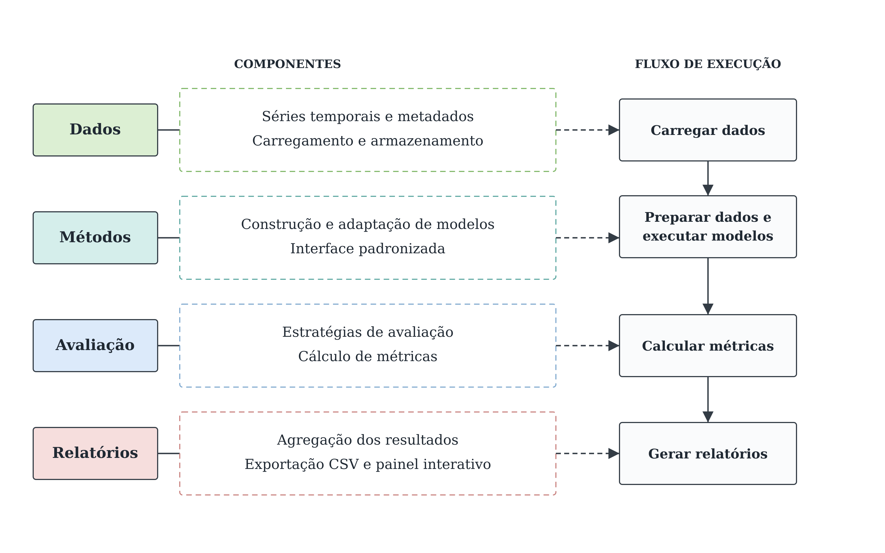

<div align="center">
  
  <p><b>Uma plataforma de Benchmarking para Séries Temporais Hierárquicas</b></p>
  <p>
    <a href="https://malbuq-dev.github.io/hts-bench/leaderboard.html">HTSBench</a>
  </p>
</div>

<p align="center"><a href="README.md">English</a> | 🇧🇷 Português</p>

<div align="center">


</div>


## Sumário

1. [Introdução](#introdução)

2. [Datasets](#datasets)

3. [Métodos de previsão](#métodos-de-previsão)

4. [Reconciliação hierárquica](#reconciliação-hierárquica)

5. [Métricas](#métricas)

6. [Instalação](#instalação)

7. [Uso rápido](#uso-rápido)

8. [Reproduzindo um experimento completo](#reproduzindo-um-experimento-completo)

9. [Atualizando o leaderboard](#atualizando-o-leaderboard)

10. [Preparando os dados](#preparando-os-dados)

11. [Como estender a plataforma](#como-estender-a-plataforma)

12. [Testes](#testes)

13. [Estrutura do projeto](#estrutura-do-projeto)

14. [Reconhecimentos](#reconhecimentos)

15. [Contato](#contato)

## Introdução

HTSBench avalia, de ponta a ponta, métodos de previsão sobre séries temporais que possuem uma **hierarquia**: séries de nível mais baixo (ex.: vendas por loja) que se somam em séries agregadas (ex.: vendas por estado, vendas totais). A plataforma roda cada método de forma independente por série, aplica uma estratégia de **reconciliação** para tornar o conjunto de previsões coerente com a hierarquia (a soma das partes bater com o todo) e calcula métricas de erro comparáveis entre métodos e datasets.

A figura abaixo resume o fluxo: os cinco componentes à esquerda (Dados, Métodos, Reconciliação, Avaliação, Relatórios) e a sequência de execução que eles implementam à direita.

<div align="center">



</div>

Em linhas gerais:

- **Dados** carrega um dataset hierárquico (`dataset/<nome>/`) e deriva a matriz de somação S que descreve a hierarquia a partir de `series_meta.csv` - nenhuma hierarquia é codificada à mão em nenhum outro lugar do código.

- **Métodos** implementam uma interface única e univariada (`MethodBase`); cada método é ajustado e previsto série por série, sem nunca enxergar a hierarquia.

- **Reconciliação** recebe as previsões brutas de todas as séries e produz um conjunto coerente com a matriz S (a soma das partes bate com o todo), por uma entre quatro estratégias (`bottom_up`, `top_down`, `min_trace`, `min_trace_shrink`).

- **Avaliação** orquestra a previsão série a série, aplica a estratégia de reconciliação escolhida e calcula as métricas, com suporte a avaliação de origem única ou de múltiplas origens (**rolling-origin**).

- **Relatórios** agrega o resultado por série em uma tabela única por método (um **leaderboard**) e pode persistir tanto o leaderboard quanto a tabela bruta por série para reprocessamento posterior sem reexecutar nenhum modelo.

## Datasets

| Dataset   | Frequência | Séries (nível base) | Horizonte sugerido | Hierarquia | Fonte |
|-----------|:----------:|:--------------------:|:-------------------:|:----------:|-------|
| `labour`  | Mensal     | 57 (32)               | 8                    | Cruzada (região × sexo × situação de emprego) | Australian Labour Force, via [Nixtla `datasetsforecast`](https://github.com/Nixtla/datasetsforecast) |
| `tourism` | Mensal     | 555 (304)              | 24                   | Cruzada (geografia × propósito da viagem) | Australian Tourism (Athanasopoulos et al.), via `datasetsforecast` |
| `traffic` | Diária     | 207 (200)               | 1                    | Em árvore | San Francisco Traffic, Rangapuram et al., **End-to-End Learning of Coherent Probabilistic Forecasts for Hierarchical Time Series**, ICML 2021 (PMLR 139:8832–8843) |
| `wiki2`   | Diária     | 199 (150)               | 1                    | Em árvore | Wikipedia page views, mesma fonte do `traffic` acima |
| `m5` (M5_lite) | Diária     | 9.180 (3.049)¹          | 28                   | Cruzada (estado × loja × categoria × departamento × item) | M5 Forecasting Competition, via `datasetsforecast.m5` (espelho dos arquivos originais do Kaggle, sem necessidade de conta) |

¹ Por padrão `m5` é convertido apenas para a loja `CA_1` - referido ao longo deste README como **M5_lite**, para deixar claro que não é o dataset completo da competição M5 - para manter o build rápido; `python scripts/convert_m5.py --store all` reconstrói o dataset completo do M5 (~30.490 séries de nível base), usando exatamente o mesmo código.

Cada dataset é um diretório `dataset/<nome>/` com três arquivos: `data.csv` (uma coluna por série, todas em um único índice de datas), `series_meta.csv` (uma linha por série, com as colunas de dimensão da hierarquia) e `meta.json` (frequência, horizonte sugerido, contagens de séries). Veja [Como estender a plataforma](#como-estender-a-plataforma) para adicionar um novo dataset.

## Métodos de previsão

Todo método implementa a interface `MethodBase` (`hts_bench/method/base.py`): univariado, agnóstico à hierarquia - recebe uma série, devolve uma previsão. Reconciliação é responsabilidade do módulo de Reconciliação, não do método.

| Método | Descrição | Biblioteca |
|---|---|---|
| `naive` | Repete o último valor observado | implementação própria |
| `seasonal_naive` | Repete o valor do mesmo ponto no ciclo sazonal anterior | implementação própria |
| `ets` | Suavização exponencial (Exponential Smoothing), com componente sazonal | `statsmodels` |
| `arima` | ARIMA | `statsmodels` |
| `theta` | Método Theta | `statsmodels` |
| `lightgbm` | Gradient boosting sobre uma janela de **lags**, por série, com previsão recursiva | `lightgbm` |

`lightgbm` é uma variante **local** (um modelo por série) - não o LightGBM "global" (um único modelo treinado sobre todas as séries de um dataset) que venceu a competição M5. Sua semente (`random_state=42`) é fixa por padrão para que reexecutar o mesmo experimento não altere os números reportados.

`theta` não implementa `fitted_values()` (o objeto de resultado do `statsmodels` para Theta não expõe valores ajustados in-sample), por isso não pode ser usado como estimador de resíduos para `min_trace_shrink` - os demais métodos podem.

## Reconciliação hierárquica

Dado um conjunto de previsões (possivelmente incoerentes entre si), a reconciliação produz um conjunto coerente com a matriz de somação S da hierarquia (y = S·b).

| Estratégia | Ideia |
|---|---|
| `bottom_up` | Soma as previsões do nível base através de S. Baseline padrão da literatura. |
| `top_down` | Desagrega o total do topo por proporções históricas médias (Gross & Sohl, 1990). Quando uma previsão independente da série raiz está disponível, ela é usada como o total a desagregar (versão de livro-texto); caso contrário, o total cai de volta para o valor implícito pelo bottom-up. |
| `min_trace` | MinT (Wickramasuriya, Athanasopoulos & Hyndman, 2019), com peso estrutural (WLSS, baseado no número de séries base que cada nó agrega) por padrão. Exige uma previsão independente para **todo** nível da hierarquia, não só o nível base. |
| `min_trace_shrink` | MinT(shrink): mesma formulação do `min_trace`, mas com a matriz de covariância estimada por **shrinkage** (Schäfer & Strimmer, 2005) a partir dos resíduos in-sample de um método auxiliar. Não aplicada ao `m5` (M5_lite) no **sweep** padrão - a inversão de uma covariância densa (n×n) deixa de ser prática na escala do M5_lite, limitação também presente no artigo original do RHiOTS, que subamostrou o M5 completo pelo mesmo motivo. |

## Métricas

`mae`, `rmse` e `mase` (Mean Absolute Scaled Error - erro absoluto médio escalado pelo erro do **naive** sazonal sobre o histórico de treino, o que a torna comparável entre séries de escalas diferentes e é especialmente mais segura que o MAPE em séries com valores zero, como em parte do M5_lite).

## Instalação

Dependências com versões fixas para reprodutibilidade (veja `requirements.txt`).

```bash
pip install -r requirements-dev.txt
```

### Docker

```bash
docker build -t hts-bench:latest .
docker run --rm -v "$(pwd)/result:/app/result" hts-bench:latest \
  --dataset labour --methods naive seasonal_naive --horizon 8 --records-dir result
```

A imagem roda a suíte de testes completa como parte do build - se algum teste falhar, a imagem não é construída. O `ENTRYPOINT` é o próprio `scripts/run_benchmark.py`, então qualquer argumento passado ao `docker run` depois do nome da imagem vai direto para o CLI.

## Uso rápido

```bash
python scripts/run_benchmark.py \
  --dataset labour \
  --methods naive seasonal_naive ets \
  --horizon 8 \
  --reconcile bottom_up
```

Para avaliação com múltiplas origens (mais robusta que uma única divisão treino/teste):

```bash
python scripts/run_benchmark.py \
  --dataset labour --methods naive seasonal_naive ets \
  --horizon 8 --n-origins 5 --reconcile min_trace --by-level
```

`--reconcile min_trace` implica previsão independente em todo nível da hierarquia automaticamente (o CLI cuida disso); `--by-level` quebra o leaderboard por nível hierárquico em vez de colapsar tudo em uma única linha por método.

## Reproduzindo um experimento completo

`scripts/run_experiments.py` varre todos os datasets, métodos e estratégias de reconciliação relevantes (pulando `min_trace_shrink` para `m5`, pelo motivo já descrito), salvando a tabela bruta por série de cada execução em `result/`:

```bash
python scripts/run_experiments.py
```

`scripts/analyze_experiments.py` então lê tudo que foi salvo em `result/` - sem reajustar nenhum modelo - e produz as visões de comparação usadas na análise de resultados: método × dataset, comparação entre estratégias de reconciliação, benefício da reconciliação por profundidade na hierarquia, e agrupamento por tipo de hierarquia (cruzada vs. em árvore):

```bash
python scripts/analyze_experiments.py
```

## Atualizando o leaderboard

A [página do leaderboard](https://malbuq-dev.github.io/hts-bench/leaderboard.html) (`docs/leaderboard.html`) não lê `result/` diretamente - ela busca um `docs/data/leaderboard.json` pré-agregado, construído por uma etapa de exportação separada:

```bash
python scripts/export_leaderboard_json.py
```

Esse script lê tudo que está em `result/` (da mesma forma que `analyze_experiments.py`, sem reajustar nenhum modelo) e sobrescreve `docs/data/leaderboard.json` com uma linha agregada por combinação de `(dataset, reconcile, method)`. Após o commit e o push do JSON atualizado, a página ao vivo reflete os novos dados automaticamente no próximo carregamento - `docs/leaderboard.html` busca o arquivo diretamente no navegador, e o GitHub Pages serve o conteúdo direto da pasta `/docs` na branch `main`, sem nenhuma etapa adicional de build ou deploy.

Um detalhe importante caso você adicione um novo dataset ou uma nova estratégia de reconciliação: `scripts/export_leaderboard_json.py` tem os datasets e as estratégias de reconciliação que procura fixados no início do arquivo (`DATASETS`, `RECONCILE_CHOICES`). Um novo item não aparece na exportação até ser adicionado também a essas duas listas, mesmo que `result/` já tenha os dados correspondentes.

## Preparando os dados

Os datasets já convertidos estão em `dataset/`; os scripts abaixo regeneram cada um a partir da fonte original, caso seja necessário:

```bash
python scripts/convert_labour.py
python scripts/convert_tourism.py
python scripts/convert_traffic.py
python scripts/convert_wiki2.py
python scripts/convert_m5.py            # loja CA_1 apenas (M5_lite, padrão)
python scripts/convert_m5.py --store all  # dataset M5 completo
```

## Como estender a plataforma

**Novo método**: implemente `MethodBase` (`hts_bench/method/base.py`) - `forecast_fit`, `forecast`, a propriedade `name` e, opcionalmente, `fitted_values()` (necessário apenas se o método for usado para estimar resíduos em `min_trace_shrink`). Tutorial completo, com um método real construído passo a passo: [docs/tutorials/steps_to_develop_your_own_method.pt-br.md](docs/tutorials/steps_to_develop_your_own_method.pt-br.md).

**Novo dataset**: crie `dataset/<nome>/` com:

- `data.csv` - índice `date`, uma coluna por série (todos os níveis, incluindo agregados);

- `series_meta.csv` - índice `series_id`, colunas `level`, `is_bottom` e uma coluna por dimensão da hierarquia (uma série de nível agregado deixa `NaN` nas dimensões que ela não especifica);

- `meta.json` - `name`, `freq`, `horizon_suggested`, `n_series`, `n_bottom`, `data_files`.

Tutorial completo, incluindo como derivar os agregados automaticamente a partir de dados de nível-base: [docs/tutorials/steps_to_evaluate_your_own_time_series.pt-br.md](docs/tutorials/steps_to_evaluate_your_own_time_series.pt-br.md).

## Testes

```bash
pytest tests/ -q
```

Cobre dados (carregamento, matriz de somação, verificação de coerência), métodos (incluindo um teste de integração ponta a ponta por método), reconciliação (incluindo coerência numérica em datasets reais), e o módulo de relatórios (persistência e **leaderboard**). Testes dependentes do M5 completo pulam automaticamente quando apenas o subconjunto padrão está disponível.

## Estrutura do projeto

```
hts_bench/
  data/           # carregamento de dataset, matriz de somação S, checagem de coerência
  method/         # interface MethodBase + adaptadores (naive, statsmodels, lightgbm)
  reconciliation/ # estratégias de reconciliação hierárquica (bottom_up, top_down, min_trace, min_trace_shrink)
  evaluation/     # execução de previsão, aplicação da reconciliação, métricas, comparação entre métodos
  report/         # persistência de resultados brutos e agregação em leaderboard
  pipeline.py     # liga os cinco módulos acima em uma única chamada
scripts/
  convert_*.py            # conversão de cada dataset para o formato do projeto
  run_benchmark.py         # CLI para uma execução pontual
  run_experiments.py       # varredura completa de datasets × métodos × reconciliações
  analyze_experiments.py   # leitura e análise dos resultados salvos, sem reexecutar modelos
dataset/    # datasets já convertidos (Labour, Tourism, Traffic, Wiki2, M5_lite)
tests/      # suíte de testes automatizados
```

## Reconhecimentos

A separação em módulos (Dados, Métodos, Reconciliação, Avaliação, Relatórios), a interface padronizada de método e o padrão de persistência de resultados brutos para reprocessamento posterior foram inspirados no [TFB](https://github.com/decisionintelligence/TFB):

```
@article{qiu2024tfb,
  title   = {TFB: Towards Comprehensive and Fair Benchmarking of Time Series Forecasting Methods},
  author  = {Xiangfei Qiu and Jilin Hu and Lekui Zhou and Xingjian Wu and Junyang Du and Buang Zhang and Chenjuan Guo and Aoying Zhou and Christian S. Jensen and Zhenli Sheng and Bin Yang},
  journal = {Proc. {VLDB} Endow.},
  volume  = {17},
  number  = {9},
  pages   = {2363--2377},
  year    = {2024}
}
```

Os datasets `traffic` e `wiki2`, e a convenção de horizonte=1 usada para ambos, vêm de:

```
@inproceedings{rangapuram2021end,
  title     = {End-to-End Learning of Coherent Probabilistic Forecasts for Hierarchical Time Series},
  author    = {Rangapuram, Syama Sundar and Werner, Lucien D. and Benidis, Konstantinos and Mercado, Pedro and Gasthaus, Jan and Januschowski, Tim},
  booktitle = {Proceedings of the 38th International Conference on Machine Learning},
  series    = {PMLR},
  volume    = {139},
  pages     = {8832--8843},
  year      = {2021}
}
```

A reconciliação `min_trace`/`min_trace_shrink` segue Wickramasuriya, Athanasopoulos & Hyndman (2019), **Optimal Forecast Reconciliation for Hierarchical and Grouped Time Series Through Trace Minimization**, JASA.

## Contato

Dúvidas, sugestões ou problemas: abra uma [issue](https://github.com/malbuq-dev/hts-bench/issues) neste repositório.
